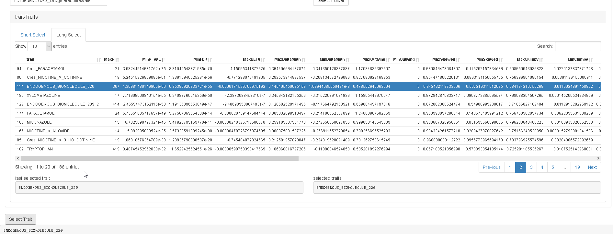
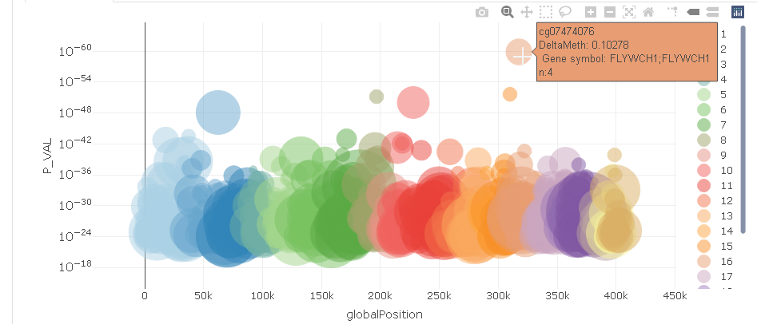

```{r, include = FALSE}
knitr::opts_chunk$set(
  collapse = TRUE,
  comment = "#>"
)
```

```{r setup}
library(EpiVisR)
```
# EpiVisR Introduction

Results from EWAS analyses usually are generated by adjusted regression models and shared in long tables with probeIDs, p-values and delta methylation β for each TUI that was analysed. So all common preprocessing steps to generate these β values (using minfi (Aryee et al., 2014) or similar packages) were done in prior steps. EpiVisR starts with a table containing probeIDs, delta methylation values and p-values.  
Out of these values, EpiVisR generates views including, Manhattan and Volcano plots, trait methylation plots, methylation profile plots as well as correlation profile plots.  
The app is subdivided into sections, which can be collapsed for better view of important things. During start sections may be collapsed and therefore invisible.

# Data Preparation

Data must be organized as .csv-files in a single folder. This folder is referenced as dataDir: </folder/for/data/files> in the <config.yml>. All results from this folder are read into a data frame and minimum as well as maximum values for all descriptive metrics become calculated. These aggregated values can be used for a first selection of TUI out of a possible long list of traits.  
Because of the static nature of the results, we implemented a caching strategy, so its not necessary to load .csv files over and over again. Instead the data frame with all results summaries is stored in a separate file for later and faster reuse.

# Selection of Traits

All traits from the data folder become listed in the trait selection table. EpiVisR reads and calculates minimum and maximum values for n, p-values, FDR, beta, delta methylation and scagnostics measures (if available in files). Sorting columns is recommended to find traits with strongest effects.

{#id .class width=700px height=350px}

Selecting a line makes the selected trait the trait under investigation and leads to the next step.

# Selection of CpG
Out of a selected CpG, a Manhattan and a volcano plot with all available CpG is displayed. It shows p-value against location on DNA (Manhattan plot) or p-value against delta methylation (volcano plot).

{#id .class width=700px height=350px}

Hovering over the plots shows properties of the CpG. Clicking on a CpG selects this CpG for further analysis. We now have selected a trait and a CpG. The following visualizations refer to this combination from trait and CpG.

# Trait Methylation Plot

The trait-methylation plot shows the range of values in the TUI vs methylation at a certain CpG. The trait-methylation plot is additionally stratified by <gender> attribute which is stored in the traits table. For better illustration of the distribution of stratified effect under investigation, an additional violin plot is shown.

{#id .class width=700px height=350px}

# DNAm Profile Plot

The methylation profile shows the methylation of all individuals (connected by lines) covered by the EWAS on a single selected CpG in the centre of the plot and its neighbouring CpG. The value of the selected TUI (e.g. concentration) is shown on a colour scale. The length of the visualization window can be  adjusted according to the selected probe using the input bar above the plot. 

{#id .class width=700px height=350px}

The methylation profile plot does not show real distances between probes. It shows only CpG available on the microarray in use (in this example GPL23976 platform).

# Correlation Profile Plot

A correlation profile plot shows trait against methylation for selected CpG and its most correlated CpGs of interest. The table shows correlation coefficients (corr.coeff) together with annotated CpG information (gene.symbol, genomic feature, etc.). Selected CpGs can be visualized in the plot below the table.

{#id .class width=700px height=350px}


--------------
End of vignette.

* list item 1
* list item 2

1. ordered 1
1. ordered 2
1. ordered 3
